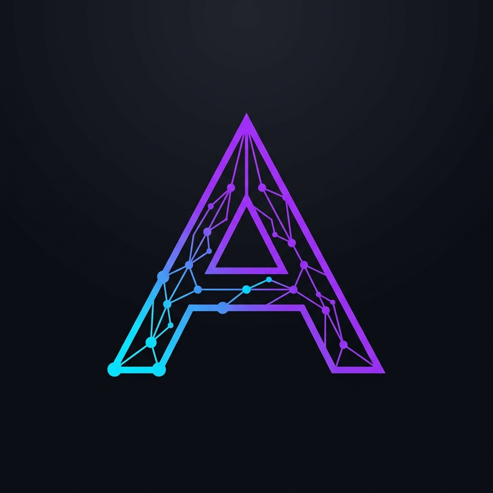

# Atul Pahal | AI Developer Portfolio

A high-end, cinematic digital portfolio showcasing engineering precision and minimalist design. Built with React and Vite, this portfolio explores the intersection of robust system architecture and fluid user interfaces.



## 🚀 Key Features

- **Atmospheric Visuals**: Custom neural network particle sphere and interactive Penguin animation using Canvas API.
- **Premium Interactions**: Advanced hover highlights and smooth transitions using modern CSS (cubic-bezier) and React state management.
- **Dynamic Theming**: Integrated Dark/Light mode support with seamless transitions.
- **Responsive Architecture**: Fully optimized for mobile, tablet, and desktop experiences.
- **Interactive Terminal**: Clean, editorial-style layout inspired by modern design systems.

## 🛠 Tech Stack

- **Frontend**: React, Vite, JavaScript (ES6+)
- **Styling**: Vanilla CSS3 (Custom Variables, Flexbox/Grid, Keyframe Animations)
- **Visuals**: Canvas API for particle systems and interactive animations.
- **Tools**: ESLint for code quality, Git for version control.

## 📁 Selected Projects

- **Movie Recommendation System**: Intelligent engine analyzing user content similarities.
- **Image Detection System**: Real-time object identification using deep learning.
- **Spam Detection**: NLP-powered message classification.
- **AI Crop Health Monitoring**: IoT and Computer Vision system for agricultural optimization.

## 📦 Getting Started

To run this project locally:

1. **Clone the repository**:
   ```bash
   git clone https://github.com/AtulPahal/Portfolio.git
   cd Portfolio
   ```

2. **Install dependencies**:
   ```bash
   npm install
   ```

3. **Run the development server**:
   ```bash
   npm run dev
   ```

4. **Build for production**:
   ```bash
   npm run build
   ```

## 📫 Contact

- **Email**: [atulpahal@gmail.com](mailto:atulpahal@gmail.com)
- **LinkedIn**: [Atul Pahal](https://www.linkedin.com/in/atul-pahal-1275aa371/)
- **X (Twitter)**: [@AtulPahal00](https://x.com/AtulPahal00)
- **GitHub**: [@AtulPahal](https://github.com/AtulPahal)

---
Developed by **Atul Pahal** · 2026
